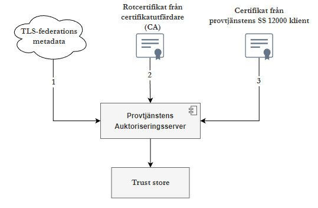
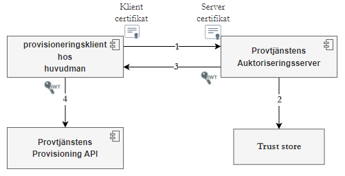
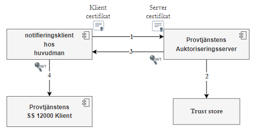
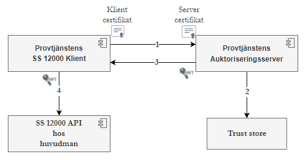

# API för autentisering

API för autentisering används för att autentisera klienter inför maskinell överföring av uppgifter
till
Skolverkets provtjänst. API:et kallas också för auktoriseringsserver eftersom det utfärdar
auktoriseringstoken till klienter efter autentisering.

## Förutsättningar för autentisering och auktorisering

För att kunna överföra uppgifter till Skolverkets provtjänst behöver du som huvudman uppfylla ett av
följande
huvudkrav:

1. Ansluta till en TLS-federation som är ansluten
   till [Fidus](https://www.skolverket.se/om-oss/var-verksamhet/skolverkets-prioriterade-omraden/digitalisering/digitala-nationella-prov/tekniska-forutsattningar-for-digitala-nationella-prov/fidus)
   samt se till att huvudmannens klientcertifikat är registrerat i ett metadataregister som
   TLS-federationen
   tillhandahåller.
   > [Läs mer om TLS-federation](https://www.ietf.org/archive/id/draft-halen-fed-tls-auth-00.html).
2. Skaffa ett klientcertifikat från en certifikatutfärdare som är godkänd av Fidus.

Utöver huvudkraven ovan gäller följande specifika krav:

* Klientcertifikatet används för att identifiera huvudmannen. Därför ska varje huvudman ha minst ett
  klientcertifikat. Leverantörer som hanterar överföring av uppgifter för flera huvudmän behöver
  tillhandahålla
  minst ett klientcertifikat per huvudman.
* Klientcertifikatet ska ha en koppling till huvudmannens organisationsnummer.
    * En huvudman som är ansluten till en TLS-federation ska registrera både klientcertifikat och
      organisationsnummer i sitt metadata. Huvudman som har en certifikatkedja som består av
      rot-certifikat, mellancertifikat och klientcertifikat kan registrera alla certifikaten i kedjan
      som `issuers` i sitt metadata, men värdet för `pins` behöver beräknas från klientcertifikatet.
    * En huvudman som har ett klientcertifikat från en certifikatutfärdare ska se till att sitt
      organisationsnummer finns i certifikatet.
* Följande alternativ finns för huvudmän som hanterar överföring av uppgifter med flera klienter
  eller flera
  SS 12000-API:er:
    * Tillhandahålla ett klientcertifikat per klient eller SS 12000-API. Notera att Skolverkets
      provtjänst
      behandlar klientcertifikaten som tillhör en huvudman lika, det vill säga att varje
      certifikatinnehavare
      har full åtkomst till huvudmannens data i provtjänsten.
    * Använda ett klientcertifikat för alla sina klienter eller SS 12000-API:er.

### Godkända TLS-federationer

I dagsläget är provtjänstens auktoriseringsserver integrerats med en TLS-federation. Denna
TLS-federation är Moa ("Machine and Organization Authentication") från Internetstiftelsen.
> [Läs mer om Moa](https://wiki.federationer.internetstiftelsen.se/pages/viewpage.action?pageId=20545581)

### Godkända certifikatutfärdare

I dagsläget är provtjänstens auktoriseringsserver integrerats med följande 3 certifikatutfärdare:

* SITHS
  funktionscertifikat. [Läs mer om SITHS funktionscertifikat](https://inera.atlassian.net/wiki/spaces/IAM/pages/359105489/Certifikatspecifikationer).
* E-identitet för offentlig sektor -
  EFOS. [Läs mer om EFOS](https://www.forsakringskassan.se/myndigheter-och-samarbetspartner/e-tjanster-for-myndigheter-och-samarbetspartner/e-identitet-for-offentlig-sektor-efos).
* Expisoft
  funktionscertifikat. [Läs mer om Expisoft funktionscertifikat](https://eid.expisoft.se/products/certificates/?product_id=5).

Följande tabeller beskriver de specifika utfärdarcertifikat som finns konfigurerats i test- och
produktionsmiljö av provtjänstens auktoriseringsserver.

Se [Hämta JWT med certifikat från godkänd certifikatutfärdare](#hämta-jwt-för-åtkomst-till-provisioning-api-med-certifikat-från-en-godkänd-certifikatutfärdare).

#### CA för produktionsmiljö av auktoriseringsserver (https://nutid-auth.sunet.se/transaction)

| **Utfärdarcertifikat (CA)**                | **Utfärdare organisation**                          |
|--------------------------------------------|-----------------------------------------------------|
| _**SITHS e-id Function CA v1**_            | Inera AB                                            |
| _**Swedish Public Sector Function CA v1**_ | Swedish Social Insurance Agency (Försäkringskassan) |
| _**ExpiTrust EID CA v4**_                  | Expisoft AB                                         |

#### CA för testmiljö av auktoriseringsserver (https://nutid-auth-test.sunet.se/transaction)

| **Utfärdarcertifikat (CA)**                    | **Utfärdare organisation**                          |
|------------------------------------------------|-----------------------------------------------------|
| _**TEST SITHS e-id Function CA v1**_           | Inera AB                                            |
| _**Swedish Public Sector Function CA SAT v1**_ | Swedish Social Insurance Agency (Försäkringskassan) |
| _**ExpiTrust Test CA v8**_                     | Expisoft AB                                         |

## Autentisering utifrån vald metod för överföring av uppgifter

Inför maskinell överföring av uppgifter till Skolverkets provtjänst krävs det att klienter
autentiserar
sig mot provtjänstens auktoriseringsserver enligt principen mTLS ("mutual Transport Layer Security")
och hämtar
JWT ("JSON Web Token").

"Trust store" för provtjänstens auktoriseringsserver förbereds genom att:

1. Hämta och aggregera metadata från olika TLS-federationer som är anslutna till FIDUS.
2. Hämta och konfigurera rotcertifikaten från olika certifikatutfärdare som är godkända av FIDUS.
3. Hämta och konfigurera certifikatet från provtjänstens SS 12000-klient.



Nedan beskrivs specifika flöden för autentisering utifrån vald metod för överföring av uppgifter.

### Autentiseringsflöde för huvudmän som överför uppgifter via Provisionerings-API - data skickas till Skolverket



1. Huvudmannens klient autentiserar sig mot provtjänstens auktoriseringsserver genom att presentera
   sitt klientcertifikat.
2. Auktoriseringsservern autentiserar klientcertifikatet mot etablerad "trust store". Huvudmannens
   klient
   kan också kontrollera servercertifikatet av auktoriseringsservern.
3. Auktoriseringsservern utfärdar JWT till klienten.
4. Huvudmannens klient presenterar JWT vid överföring av uppgifter till provtjänstens
   Provisioning-API.

Se [Hämta JWT för åtkomst till Provisioning API](#hämta-jwt-för-åtkomst-till-provisioning-api-med-certifikat-i-en-tls-federation).

### Autentiseringsflöde för huvudmän som överför uppgifter enligt standarden SS 12000 – Skolverket hämtar data

Denna metod för överföring av uppgifter består av två huvudsteg utifrån vilken part som initierar
kommunikationen. Vid förändringar av uppgifter skickar huvudmannen notifiering, som också kallas "
webhook", till
Skolverkets provtjänst. Utifrån informationen som finns i notifieringen hämtar Skolverkets
provtjänst förändringar
från huvudmannens SS 12000-API. Autentiseringsflöden för dessa två steg beskrivs nedan.

#### _Autentiseringsflöde vid notifiering av ändrade uppgifter_



1. Huvudmannens notifieringsklient autentiserar sig mot provtjänstens auktoriseringsserver genom att
   presentera
   sitt klientcertifikat.
2. Auktoriseringsservern autentiserar klientcertifikatet mot etablerad "trust store".
   Notifieringsklienten kan också
   kontrollera servercertifikatet av auktoriseringsservern.
3. Auktoriseringsservern utfärdar JWT till notifieringsklienten.
4. Notifieringsklienten presenterar JWT vid notifiering av förändringar till provtjänstens SS
   12000-klient.

Se [Hämta JWT för åtkomst till notifieringsändpunkt av SS12000-klienten](#hämta-jwt-för-åtkomst-till-notifierings-ändpunkten-av-provtjänstens-ss12000-klient-med-certifikat-i-en-tls-federation).

#### _Autentiseringsflöde vid datainhämtning_



1. Provtjänstens SS 12000-klient autentiserar sig mot provtjänstens auktoriseringsserver genom att
   presentera
   sitt klientcertifikat.
2. Auktoriseringsservern autentiserar klientcertifikatet mot etablerad "trust store". Provtjänstens
   SS 12000-klient
   kan också kontrollera servercertifikatet av auktoriseringsservern.
3. Auktoriseringsservern utfärdar JWT till klienten.
4. Skolverkets SS 12000-klient presenterar JWT till huvudmannens SS 12000-API vid hämtning av
   förändrade uppgifter.

Se [Hämta JWT för åtkomst till SS12000-API hos huvudman](#hämta-jwt-för-åtkomst-till-huvudmannens-ss12000-api-med-certifikat-i-en-tls-federation).

## HTTP-anrop mot auktoriseringsserver

Beroende på vilken typ av certifikat som huvudmannen har finns det två typer av HTTP-anrop som
kan användas för att hämta JWT från provtjänstens auktoriseringsserver. Nedan finns 4 exempelanrop
för hur JWT kan hämtas från provtjänstens auktoriseringsserver. Första 3 exemplen avser certifikat
som finns med i en TLS-federation metadata medan det sista exemplet avser en certifikat från godkänd
certifikatutfärdare.

### Hämta JWT för åtkomst till Provisioning API med certifikat i en TLS-federation

````shell script
$curl --cert huvudmans-fedtls-cert.crt --key huvudmans-fedtls-cert-private.key \
     --pinnedpubkey sha256//R5cSCBU6RKC6WrzmAcuMhtay+tXuaHUh4CxSWmSal1g=  \
     -X POST 'https://nutid-auth.sunet.se/transaction' \
     -H "Content-Type: application/json" \
     --data-raw '{
        "access_token": [
            {
                "access": [
                    {
                        "type": "provisioning-api",
                        "locations": [
                            "https://api.skolverket.se/provtjanst/provisioning/v1"
                        ]
                    }
                ],
                "flags": [
                    "bearer"
                ]
            }
        ],
        "client": {
            "key": "https://testhuvudman.se"
        }
    }'
````

Beskrivning av ovanstående `Curl` kommand:

* `curl` är ett kommandoradsverktyg för dataöverföring.
* `--cert huvudmans-fedtls-cert.crt` pekar på var certifikatets publika nyckel finns i filsystemet.
* `--key huvudmans-fedtls-cert-private.key` pekar på var privata nyckel för certifikatet finns i
  filsystemet.
* `--pinnedpubkey sha256//R5cSCBU6RKC6WrzmAcuMhtay+tXuaHUh4CxSWmSal1g=` används för att autentisera
  server certifikatet av auktoriseringsservern.
* `--data-raw` är JSON-data som skickas till auktoriseringsservern i anropet.
* `client.key` i JSON-data är identifierare (entityId) för specifika metadata för klienten.
* `locations` i JSON-data ska innehålla bas-URL till provtjänstens Provisioning-API.
* `https://nutid-auth.sunet.se/transaction` är URL till auktoriseringsservern i produktionsmiljö.

Efter autentisering av klienten utfärdar auktoriseringsservern ett JWT som returneras i svaret. JWT
hittas i attributet `access_token.value`.

````json
{
  "access_token": {
    "value": "eyJhbGciOiJ...17A2kqYewNw",
    "access": [
      {
        "type": "provisioning-api",
        "locations": [
          "https://api.skolverket.se/provtjanst/provisioning/v1"
        ]
      }
    ],
    "expires_in": 864000,
    "flags": [
      "bearer"
    ]
  }
}
````

### Hämta JWT för åtkomst till notifierings ändpunkten av Provtjänstens SS12000-klient med certifikat i en TLS-federation

Exempel anrop:

````shell script
$curl --cert huvudmans-fedtls-cert.crt --key huvudmans-fedtls-cert-private.key \
     --pinnedpubkey sha256//R5cSCBU6RKC6WrzmAcuMhtay+tXuaHUh4CxSWmSal1g=  \
     -X POST 'https://nutid-auth.sunet.se/transaction' \
     -H "Content-Type: application/json" \
     --data-raw '{
        "access_token": [
            {
                "access": [
                    {
                        "type": "ss12000-client",
                        "locations": [
                            "https://api.skolverket.se/provtjanst/ss12000/klient/v1"
                        ]
                    }
                ],
                "flags": [
                    "bearer"
                ]
            }
        ],
        "client": {
            "key": "https://testhuvudman.se"
        }
    }'
````

Notera att `locations` i JSON-data ska innehålla bas-URL till provtjänstens SS12000-klient

### Hämta JWT för åtkomst till huvudmannens SS12000-API med certifikat i en TLS-federation

Exempel anrop som skickas från provtjänstens SS12000-klient till auktoriseringsserver för åtkomst
till en huvudmans
SS12000-API:

````shell script
$curl --cert skolverket-ss12k-klient.crt --key skolverket-ss12k-klient-private.key \
     --pinnedpubkey sha256//R5cSCBU6RKC6WrzmAcuMhtay+tXuaHUh4CxSWmSal1g=  \
     -X POST 'https://nutid-auth.sunet.se/transaction' \
     -H "Content-Type: application/json" \
     --data-raw '{
        "access_token": [
            {
                "access": [
                    {
                        "type": "ss12000-api",
                        "locations": [
                            "https://testhuvudman.se/ss12000-api/v2.0"
                        ]
                    }
                ],
                "flags": [
                    "bearer"
                ]
            }
        ],
        "client": {
            "key": "https://api.skolverket.se/provtjanst/ss12000/klient/v1"
        }
    }'
````

Notera att huvudmannens SS12000-API url anges under `locations`.

### Hämta JWT för åtkomst till Provisioning API med certifikat från en godkänd certifikatutfärdare

````shell script
$curl --cert huvudmans-expisoft-cert.crt --key huvudmans-expisoft-cert-private.key \
     -X POST 'https://nutid-auth.sunet.se/transaction' \
     -H "Content-Type: application/json" \
     --data-raw '{
        "access_token": [
            {
                "access": [
                    {
                        "type": "provisioning-api",
                        "locations": [
                            "https://api.skolverket.se/provtjanst/provisioning/v1"
                        ]
                    }
                ],
                "flags": [
                    "bearer"
                ]
            }
        ],
        "client": {
            "key": {
                "proof": "mtls",
                "cert#S256": "Ct4nIeRScfjAT6ZMn41bWuMEg5Dv7nmg170O8tG1PhI="
            }
        }
    }'
````

Notera att `client.key.cert#S256` är fingeravtryck för certifikatet. Följande kommando kan användas
för att generera fingeravtryck för ett certifikat.
`openssl x509 -in huvudmans-expisoft-cert.crt -noout -sha256 -fingerprint | sed -e 's/.*=//' -e 's/://g' | xxd -r -p | base64`

### Verifiering av JWT som skickas från Provtjänstens SS12000-Klient

JWT som skickas från provtjänstens SS12000-klient till huvudmannens SS12000-API ser ut som följande.

````json
{
  "aud": "nutid",
  "auth_source": "tlsfed",
  "entity_id": "https://api.skolverket.se/provtjanst/ss12000/klient/v1",
  "exp": 1708738850,
  "iat": 1708702850,
  "iss": "https://nutid-auth.sunet.se",
  "nbf": 1708702850,
  "organization_id": "SE2021004185",
  "requested_access": [
    {
      "locations": [
        "https://testhuvudman.se/ss12000-api/v2.0"
      ],
      "type": "ss12000-api"
    }
  ],
  "source": "https://prod.kontosynk.se",
  "version": 1
}
````

Huvudmän behöver göra följande kontroll på en JWT som skickas från SS12000-klienten.

1. Verifiera att JWT har utfärdats av rätt auktoriseringsservern med hjälp av nyckeln ("JSON Web Key
   Set - JWKS") som
   finns i denna URL: https://nutid-auth.sunet.se/.well-known/jwks.json. Nedan finns ett exempel på
   nyckel.
    ````json
    {
    "keys": [
        {
            "kty": "EC",
            "kid": "nutid_auth_202201",
            "crv": "P-256",
            "x": "ft1GPF2pThpthgPpIyDLvH3Zr2QtBp8UeaeInESUXls",
            "y": "D1BKcyK-n4biTlnea_69YOVvA0KY-ei-4AlV-dfPBnU"
        }
      ]
    }
    ````
2. Kontrollera att `organization_id` i JWT är Skolverkets organisationsnummer (SE2021004185).
3. Kontrollera att JWT är utfärdad för att endast komma åt huvudmannens SS12000-API som är
   specificerad under `requested_access`.
    `````json
    {
      "locations": [
        "https://testhuvudman.se/ss12000-api/v2.0"
      ],
      "type": "ss12000-api"
    }
    `````
4. Det är också viktigt att kontrollera JWT:s giltighet med hjälp av informationen under `nbf`
   och `exp`.

## Kontakt

https://www.skolverket.se/kontakt
