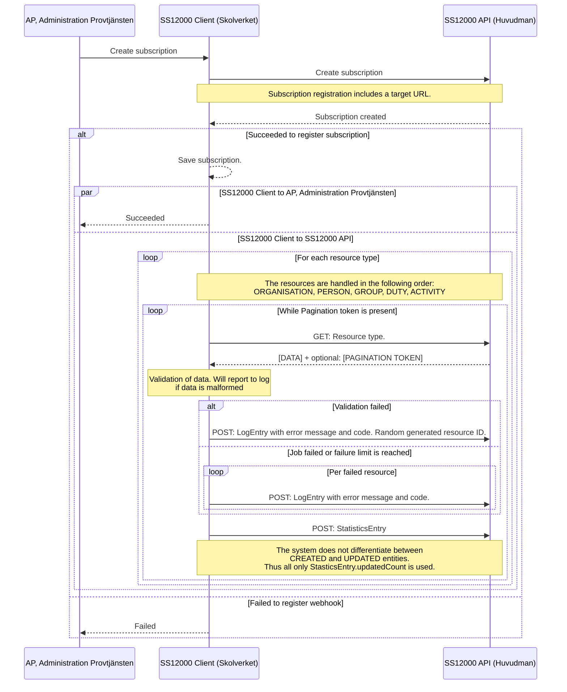
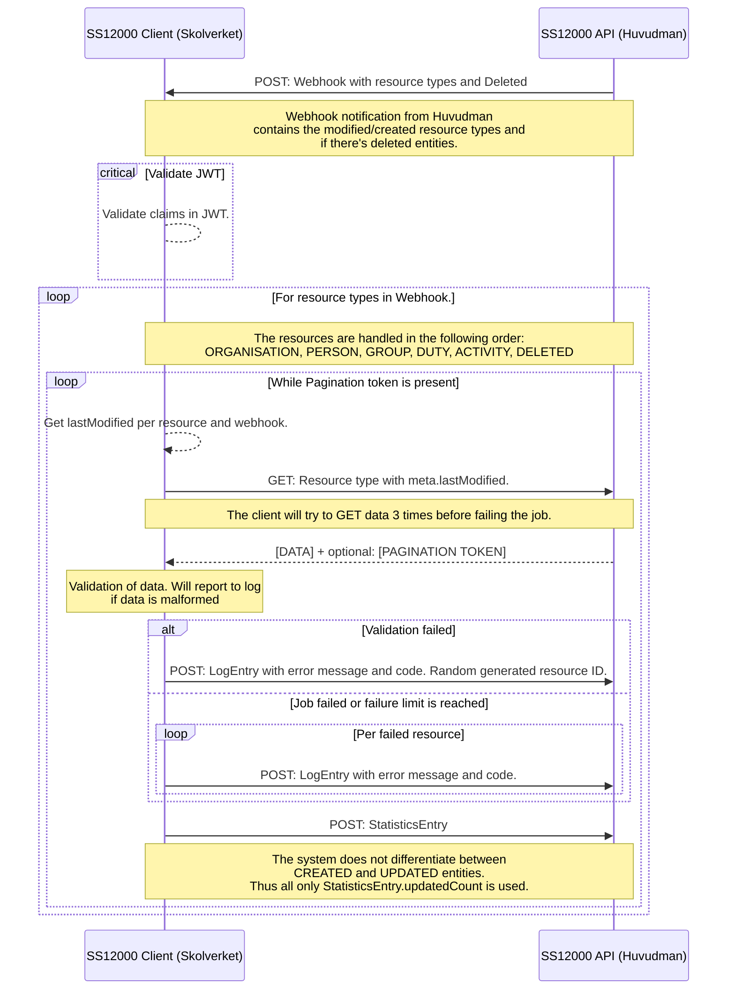

# SS12000-Client

SS12000 client, även benämnt som "pull" metoden; där Skolverket hämtar data från huvudmännens registrerade APIer. 
Pull metoden är huvudsakliga metoden för provisionering till DNP. 

## Registrera en prenumeration.
Subscription registrering (även kallt webhook registrering) sker via Administration Provtjänsten (AP). 
Huvudmannen förväntas tillhandahålla en bas-URL för ett SS12000 API (för vidare dokumentation om ["Huvudmannens api"](#huvudmannens-api) se nedan). 
Vid registrering via AP så gör SS12000 Client ett anrop till den angivna APIets subscriptions endpunkt för att registrera webhooken. 
Vid en lyckad registrering så aviseras AP om lyckade registreringen av preparation samt hämtningen av data påbörjas.  
Registreringen av prenumeration innehåller en `target` URL som huvudmannens API måste använda vid notifieringar om förändringar och borttag av data.
`target` URLen är unik för den specifika prenumerationen och bör inte delas mellan flera system. 

## Webhooks

1. **Webhook mottags:**
   - **Huvudmannens API skickar en webhook** till SS1200 Client som innehåller information om resurstyper och eventuellt borttagna entiteter.

2. **JWT Validering:**
   - SS1200 Client validerar JWT (JSON Web Token) och dess anspråk (claims).

3. **Hantering av Resurstyper:**
   - För varje resurstyp i webhook-meddelandet hanteras resurserna i följande ordning: ORGANISATION, PERSON, GROUP, DUTY, ACTIVITY, DELETED.
   - Så länge det finns en pagineringstoken i svaret från huvudmannens API:
      - SS1200 Client hämtar `lastModified` per resurs och webhook.
      - SS1200 Client skickar ett GET-meddelande till API för att hämta resurstypen med `meta.lastModified`.
      - API svarar med data och eventuellt en pagineringstoken.
      - **Notering:** Klienten kommer att försöka hämta data tre gånger innan jobbet anses misslyckat.

4. **Felhantering:**
   - Om jobbet misslyckas eller om antalet tillåtna fel överskrids (3):
      - För varje misslyckad resurs skickar SS1200 Client ett POST-meddelande till API med en loggpost som innehåller ett felmeddelande och en felkod.

5. **Statistikrapportering:**
   - SS1200 Client skickar ett POST-meddelande till API med en statistikpost.
   - **Notering:** Systemet skiljer inte mellan skapade och uppdaterade entiteter, därför används endast `StatisticsEntry.updatedCount`.

### Att tänka på vid webhook notiser

#### Race condition vid flera webhooks. 
Ordningen på hämtning av resurser kan bara garanteras om de kommer in samtidigt (samma webhook). Kommer en webhook (1) med ``PERSONS`` och ``GROUPS``, 
sedan ytterligare en webhook (2) för GROUPS så finns risken att ``GROUPS`` för webhook 2 hanteras innan ``PERSONS`` för webhook 1 färdigställts. 

## Huvudmannens API
Huvudmannens SS12000 API behöver inte stödja hela SIS SS 12000:2020 standarden, ett sub-set av funktionalitet förväntas. 
För vidare information rekommenderas att man läser in på [referens implementationen](https://github.com/skolverket/dnp-ss12000-reference-api). 
  
## Se även 
* [Referens implementationen av huvudmannens API](https://github.com/skolverket/dnp-ss12000-reference-api).
* [Miljöer](../environments.md)

## Kontakt och frågor
Vid tekniska frågor är det bäst att starta ett issue under [referens implementationen repo här på GitHub](https://github.com/skolverket/dnp-ss12000-reference-api). 
För alla andra frågor kontakta skolverket https://www.skolverket.se/kontakt
  

     
**Notera att arbetet med digitala nationella prov (DNP) är ett pågående projekt och att
materialet i DNP användarhantering uppdateras kontinuerligt.** Det är inte fastställd
information från Skolverket, utan dokumenten kommer att uppdateras.
